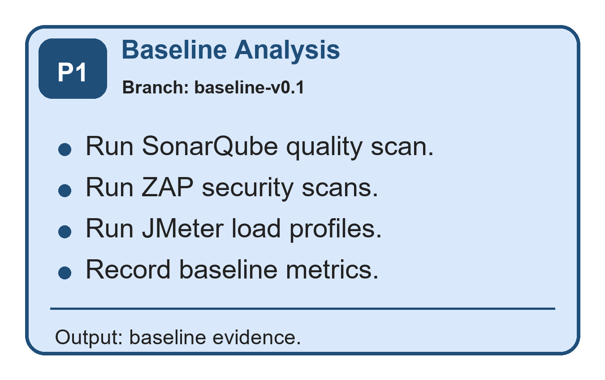
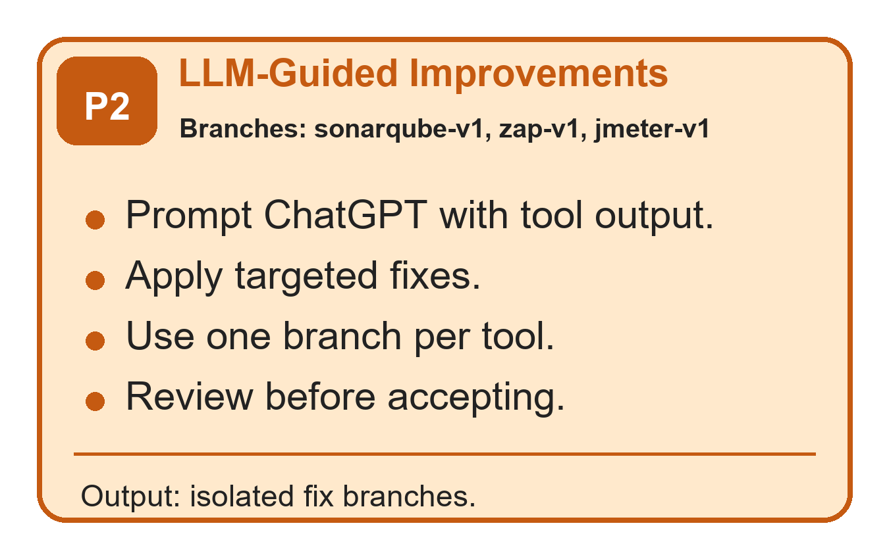
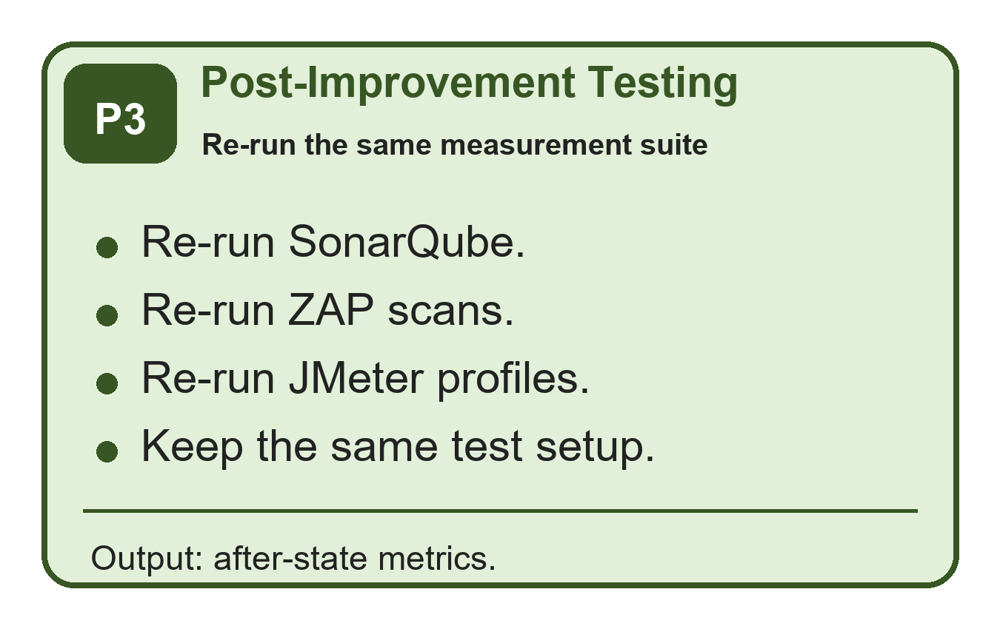
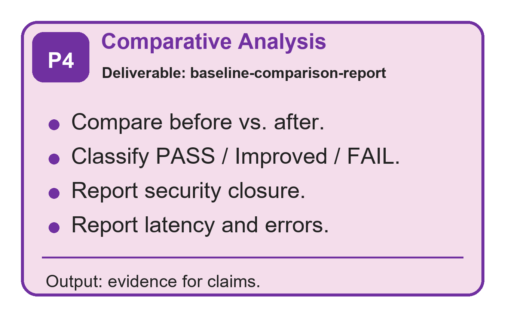

# Evaluating ChatGPT (Codex 5.4) for Security, Performance, and Code-Quality Improvement of a Financial Accounting REST API: A Branch-Isolated Baseline Study

*Plain-text preview of [ieee-paper.tex](ieee-paper.tex). This Markdown is for on-screen reading only; the PDF submission is produced from the LaTeX source.*

**Author:** Zaw Ye Htut Ko — Graduate Program in Information Technology, Assumption University, Bangkok, Thailand — kozawyehtutko43@gmail.com
**Advisor:** Paitoon Porntrakoon — Assumption University, Bangkok, Thailand

## Abstract

Large Language Models (LLMs) such as ChatGPT are increasingly used as *code advisors* on existing codebases, but empirical evidence for their effectiveness beyond pure code generation remains thin. This paper reports a branch-isolated baseline study that evaluates ChatGPT (Codex 5.4) as an improvement advisor for a non-trivial ASP.NET Core RESTful API used in financial accounting, across three independent quality dimensions: static code quality, application security, and load performance. We apply a four-phase workflow — baseline analysis, LLM-guided improvements, post-improvement re-testing, and comparative analysis — and isolate each improvement class onto a dedicated Git branch to enable reproducible before/after comparison. SonarQube findings dropped from 28 to 0 (code smells 21 → 0, quality gate OK, coverage 74.3%). OWASP ZAP baseline + authenticated API scans cleared all Medium and Low alerts on business endpoints. JMeter load profiles at 50, 100, and 500 virtual users improved p95 latency by 73.7–87.0%, soak p95 by 94.2%, and spike p95 by 79.1%, all with 0% error rate; only a mixed-workload drift heuristic remained red. The results provide empirical support for using LLMs as targeted code-review advisors when paired with automated measurement tools, and surface a concrete limitation on metrics that depend on workload composition rather than absolute latency.

**Keywords:** ChatGPT, Large Language Models, code review, API security, performance engineering, static analysis, OWASP ZAP, Apache JMeter, SonarQube, software quality

---

## I. Introduction

Software teams routinely adopt AI coding assistants such as ChatGPT and GitHub Copilot for green-field code generation, and a growing body of empirical work evaluates the *generation* quality of these tools [1,2,8,10]. Much less evidence exists on using the *same* models in an advisory role on an existing, non-trivial codebase, where the task shifts from "produce correct code" to "triage and remediate measured issues." For enterprise APIs — where bugs are caught by static analyzers, scanners, and load tests rather than by unit tests alone — this gap matters, because the LLM's value proposition is only partially captured by generation benchmarks.

Prior studies have shown that LLM-generated code can introduce security weaknesses [11,12,13], and systematic reviews place LLM use in software engineering as an emerging but heterogeneous practice [14]. Meanwhile, static analysis rules can themselves be noisy [15], and API quality is multidimensional [5]. A coherent experimental framework that (i) fixes an existing API as the unit of analysis, (ii) measures security, performance, and code quality independently, and (iii) uses the LLM only as an *advisor* feeding off tool reports, is still missing from the literature we surveyed.

**Why this work matters.** Production REST APIs in regulated domains such as finance fail in three distinct ways: a static-analysis violation (a code smell that creeps in over time), a security alert (a missing security header, a vulnerable bundled dependency, an unprotected route), and a performance hotspot (a response that breaks an SLA under load). The three failures are caught by three different tools, demand three different remediation styles, and are usually owned by three different teams. If a general-purpose LLM can give correct, framework-aware advice across all three at once — using only the structured tool report and the relevant code excerpt — it materially shortens the audit-to-fix cycle that is the bottleneck of modern API quality work. Establishing whether and where this works requires the kind of branch-isolated empirical evidence that the present study provides, and the answer is directly actionable for practitioners deciding whether to embed LLMs in their CI/CD review loop.

**Outcome summary.** On a 98-test ASP.NET Core 8.0 financial-accounting API, ChatGPT (Codex 5.4) acting purely as an advisor on tool output drove SonarQube findings from 28 to 0 (quality gate OK, coverage held at 74.3%); cleared all High/Medium/Low ZAP alerts on business endpoints; and cut p95 latency by 73.7–94.2% across five JMeter profiles with 0% errors. One result also failed: the mixed-workload drift heuristic remained red, because it is a property of how the workload composition shifts over time, not of any single endpoint. The pattern that emerges — strong on per-finding fixes with a clear template, weak on metrics that depend on global workload structure — is the empirical core of this paper and a concrete guide to where the LLM should be trusted and where a human still has to intervene.

**Contributions.** We present a branch-isolated methodology and empirical results for ChatGPT (Codex 5.4) as an improvement advisor for a research-grade financial accounting REST API built on ASP.NET Core. Specifically: (1) a reproducible four-phase workflow that isolates each tool's fixes on a dedicated branch; (2) empirical before/after data across SonarQube code quality, OWASP ZAP security, and Apache JMeter performance; and (3) an honest account of where the LLM-guided fixes clear the gates and where they do not, namely a mixed-workload drift heuristic that survives even after large absolute-latency wins.

## II. Related Work

**LLM code generation and productivity.** Fajkovic and Rundberg [1] and Ságodi et al. [2] compare ChatGPT and GitHub Copilot on code synthesis. Peng et al. [10] provide a controlled study of Copilot's effect on developer throughput. Özpolat et al. [3] and Chen et al. [4] explore ChatGPT-based tools in wider software processes. Yetiştiren et al. [8] evaluate the code quality of AI-assisted generation tools empirically.

**LLMs and security.** Pearce et al. [11] audit Copilot contributions against CWE categories; Khoury et al. [12] evaluate the security of ChatGPT-generated code; Sandoval et al. [13] run a user study on LLM code assistants and participant-introduced vulnerabilities. Mousavi et al. [6] show that LLMs frequently misuse Java Security APIs. Szabó and Bilicki [7] propose using GPT models for source-code security inspection. Flores and Monreal [9] catalog OWASP-aligned vulnerabilities in real-world web applications.

**APIs, static analysis, and LLMs for SE.** Zhang et al. [5] give a large-scale empirical study of Web API features and issues. Lenarduzzi et al. [15] question whether SonarQube rules actually catch real bug-inducing changes. Hou et al. [14] provide a systematic literature review of LLMs for software engineering, which positions our study within the broader taxonomy of "LLM as reviewer / advisor."

Our work differs from prior studies along two axes: (i) the unit of analysis is a *single existing API*, fixed under controlled branches, rather than a corpus of generated snippets; and (ii) three independent measurement tools (SonarQube, ZAP, JMeter) are combined in one before/after framework rather than evaluated in isolation.

## III. Methodology

This section presents the methodology in three parts. §III-A describes the system under test — the financial-accounting REST API whose code base is the unit of analysis. §III-B introduces the four-phase, branch-isolated workflow that captures baseline metrics, generates LLM-guided fixes, re-tests, and aggregates a comparative report. §III-C documents the prompting protocol that turns raw tool output into a reproducible LLM query, with every prompt and response archived alongside its branch. The intent of this design is that any third party can re-run any phase, on any branch, and reach the same numbers.

### A. System Under Test

The system under test is a research-grade ASP.NET Core 8.0 RESTful API for double-entry financial accounting. It exposes endpoints for authentication (JWT), chart of accounts, journal entries (including `POST /journal-entries/bulk` with debit/credit line validation), accounting-period management, four financial reports (trial balance, profit-and-loss, balance sheet, account ledger), and audit logging. Authorization uses role-based access control with four roles (Admin, FinanceManager, User, Auditor). The solution is multi-tier (API, BAL/Services, MODEL/Entities, Tests) with 98 unit and integration tests backing the baseline.

### B. Four-Phase Workflow

Figure 1 separates the four-phase workflow into readable phase panels. Each phase addresses one objective of the study, and each tool's fixes are isolated on a dedicated Git branch so that before/after deltas are attributable to a single dimension.

|  |  |
|---|---|
|  |  |
|  |  |

*Figure 1. Separated four-phase research workflow with branch isolation per tool.*

- **Phase 1: Baseline.** On branch `baseline-v0.1` we run SonarQube (code quality), OWASP ZAP (baseline scan + authenticated API scan), and Apache JMeter (load profiles at 50, 100, and 500 virtual users, a 15-min soak, and a burst spike).
- **Phase 2: LLM-guided improvements.** We prompt ChatGPT (Codex 5.4) with the structured tool output together with the affected code. Each class of fix is merged into a dedicated branch: `baseline-sonarqube-v1`, `baseline-zap-v1`, `baseline-jmeter-v1`.
- **Phase 3: Post-improvement testing.** The same tool matrix is re-run against each fix branch, using identical configuration.
- **Phase 4: Comparative analysis.** Baseline and post-fix outputs are aggregated into a comparison report that classifies every metric as PASS, Improved, or FAIL against pre-registered thresholds.

### C. Prompting Protocol

To reduce drift from non-deterministic LLM output, all prompts follow a three-part template: (a) *context* = the tool-reported issue block in its native format; (b) *code excerpt* = the smallest compilable unit that contains the finding; (c) *instruction* = "propose a minimal patch that keeps existing tests green and does not introduce new dependencies." Every prompt and response is archived alongside the branch for traceability, consistent with the reproducibility guidance surfaced in recent LLM-for-SE reviews [14].

## IV. Experiments and Results

We instrument the system under test with three independent measurement tools — SonarQube for static code quality, OWASP ZAP for application security, and Apache JMeter for load performance — and run each tool both on the baseline branch (`baseline-v0.1`) and on its dedicated fix branch (`baseline-sonarqube-v1`, `baseline-zap-v1`, `baseline-jmeter-v1`). Sections IV-A through IV-C take each tool in turn and present, for that tool: (i) what the tool is and what it measures, (ii) why this study targets that quality dimension, (iii) the experimental configuration, (iv) the result table, (v) how to read the table, and (vi) a discussion of where the LLM helped and where it did not. Section IV-D zooms in on the endpoint-level performance hotspots that dominated baseline failures.

### A. Code Quality with SonarQube

**What is SonarQube?** SonarQube is an open-source static-analysis platform that scans source code for *bugs* (probable defects), *vulnerabilities* (known security weaknesses), *code smells* (maintainability issues), *security hotspots* (suspicious patterns flagged for manual review), test coverage, and code duplication. Findings are emitted with rule IDs (e.g., `S125`, `S6966`), severities, and human-readable remediation guidance.

**Why this dimension?** Code bases of any age accumulate code smells faster than they accumulate bugs. If an LLM can address rule-by-rule findings without regressions on the test suite, it removes one of the chief reasons that quality dashboards stay red and refactoring backlogs grow without bound.

**Experiment.** SonarQube Community Edition 10.x runs against `baseline-v0.1` and `baseline-sonarqube-v1` with the default C# quality profile. Coverage is supplied by `coverlet` from the xUnit run (98 tests). The same scanner configuration is used on both branches; only the source under analysis differs.

**Table I. SonarQube code quality, before vs. after.**

| Metric | Before | After | Δ |
|---|---:|---:|---:|
| Baseline C# findings | 28 | 0 | −28 |
| Bugs | 0 | 0 | 0 |
| Vulnerabilities | 0 | 0 | 0 |
| Code Smells | 21 | 0 | −21 |
| Security Hotspots | 0 | 0 | 0 |
| Coverage (%) | 74.3 | 74.3 | 0.0 |
| Duplicated lines (%) | 0.0 | 0.0 | 0.0 |
| Quality Gate | n/a† | OK | pass |

† The retained baseline event payload did not preserve a quality-gate flag; the regenerated measure history shows a clean after-state.

**Reading the table.** *Baseline C# findings* is the total raw issue count emitted by the scanner before any de-duplication. *Bugs*, *Vulnerabilities*, *Code Smells*, and *Security Hotspots* are SonarQube's four issue categories. *Coverage (%)* is the proportion of executable lines exercised by the test suite. *Duplicated lines (%)* is the fraction of source duplicated against another file according to SonarQube's clone detector. *Quality Gate* is the pass/fail decision SonarQube emits against the project's gate criteria.

**Findings.** The baseline carried 28 C# issues. After the LLM-guided fixes on `baseline-sonarqube-v1`, the regenerated issue file contained zero findings, the quality gate reached OK, line coverage held at 74.3%, and duplicated-lines density reached 0.0%. Fixes were predominantly mechanical and aligned with rule intent: removing dead commented code (`S125`), converting the entrypoint to `await app.RunAsync()` (`S6966`), collapsing a many-parameter paging signature into a query DTO (`S107`), extracting repeated string literals (`S1192`), and sealing a private nested type (`S3260`). A subset of fixes — Azure Resource Manager template ordering (`S6975`) and camelCase (`S117`) in ARM contexts — required the model to respect provider-specific conventions and were accepted only after manual review; the LLM needed two or three rounds before it produced text the linter accepted, consistent with prior security-oriented findings that models can misuse framework conventions when the "obvious" template is subtly wrong in the target framework [6,11,12].

### B. Security with OWASP ZAP

**What is OWASP ZAP?** OWASP Zed Attack Proxy (ZAP) is a free, open-source dynamic application security testing (DAST) tool. It performs a *passive* baseline scan that observes responses to crawled requests for missing security headers, cookie problems, and known-vulnerable bundled JavaScript libraries; and an *active* API scan that, given an OpenAPI definition and a valid authentication token, exercises every endpoint and probes for OWASP Top-10–style flaws. Findings are emitted by *risk level*: High, Medium, Low, Informational.

**Why this dimension?** APIs in financial domains are routinely targeted: they handle money, identity, and audit-grade records. A vulnerability that survives into production can cost more than the entire engineering budget to remediate. DAST tools such as ZAP catch real-world exposures (missing CSP, weak CORS, vulnerable dependencies) that static analysis cannot see, and they do so on the running service rather than on the source tree.

**Experiment.** OWASP ZAP 2.14 with two profiles run against both branches: (i) a *baseline* passive scan over the public surface (`/`, `/swagger`, `/swagger/index.html`, `/swagger/v1/swagger.json`); (ii) an *authenticated API scan* driven by the OpenAPI definition against every business endpoint with a valid JWT. Identical configuration, identical endpoint list.

**Table II. OWASP ZAP alerts, before vs. after.**

| Severity | Baseline scan Before | Baseline scan After | API scan Before | API scan After |
|---|---:|---:|---:|---:|
| High | 0 | 0 | 0 | 0 |
| Medium | 2 | 0 | 0 | 0 |
| Low | 6 | 0 | 3 | 0 |
| Informational | 3 | 4 | 5 | 5 |

**Reading the table.** Each cell is the count of distinct alerts at the given severity. *High* alerts are findings ZAP considers exploitable with high confidence (e.g., SQL injection, exposed credentials). *Medium* indicates real but lower-impact issues such as missing security headers on user-facing pages. *Low* flags hardening recommendations. *Informational* alerts are observations rather than vulnerabilities (e.g., authentication-request fingerprinting, non-storable/cacheable content noted by the scanner). The pre-registered gate is that no High, Medium, or Low alert remains on a business endpoint after fixes; informational alerts are reported but not gated.

**Findings.** Both scans cleared all gated severities on business endpoints. Five alert classes were closed: (i) CSP header missing on Swagger routes, fixed by moving `SecurityHeadersMiddleware` ahead of the Swagger middleware; (ii) missing `X-Content-Type-Options` on the OpenAPI document; (iii) missing `COEP`, `COOP`, `CORP`, `Permissions-Policy` on Swagger routes; (iv) a vulnerable DOMPurify bundled in Swashbuckle, cleared by upgrading `Swashbuckle.AspNetCore` 6.7.3 → 10.1.5; and (v) an unexpected `Content-Type` on the Swagger index, resolved by disabling the UI by default and redirecting to the OpenAPI document. Each fix matches a well-known remediation template, and the LLM's role was to point the developer at the right template once the ZAP alert had localized the problem — consistent with prior reports that LLMs propose valid security-header remediations when the vulnerability class is well-documented [7,11].

### C. Performance with Apache JMeter

**What is Apache JMeter?** Apache JMeter is a load-testing tool that simulates concurrent virtual users (VUs) issuing HTTP requests according to a configurable plan. For each request it records latency (response time), throughput (transactions per second), and error rate (HTTP 4xx/5xx responses). Test plans can hold load constant, sustain it for a soak window, or burst it for a spike, and JMeter aggregates the resulting `.jtl` event log into per-endpoint percentiles.

**Why this dimension?** Static analysis and security scanning cannot tell you whether the API will keep responding under realistic load. p95 latency and error rate under load are the primary user-facing quality signals that determine whether an SLA is met, and they degrade in ways that none of the other tools can detect.

**Experiment.** Apache JMeter 5.6 with five profiles run against both branches: *p50*, *p100*, *p500* (constant load at 50, 100, and 500 VUs respectively), *soak* (15-minute mixed workload), and *spike* (burst to peak then release). Each profile emits an end-to-end `.jtl` file from which we compute p95, p99, throughput, and error rate per endpoint. Benchmark gates are pre-registered.

**Table III. JMeter results by profile (p95 in ms; error rate in %).**

| Profile | p95 Before | p95 After | Δ (%) | Err After | Gate |
|---|---:|---:|---:|---:|---|
| p50 | 49.45 | 13.00 | −73.7 | 0.00 | PASS |
| p100 | 261.95 | 34.00 | −87.0 | 0.00 | PASS |
| p500 | 176.00 | 28.00 | −84.1 | 0.00 | PASS |
| Soak | 970.95 | 56.00 | −94.2 | 0.00 | Improved‡ |
| Spike | 6795.00 | 1420.00 | −79.1 | 0.00 | Improved‡ |

‡ Absolute latency passes; the mixed-workload drift heuristic remains FAIL — see *Findings* below.

**Reading the table.** *p95 Before/After* is the 95th-percentile response time across all requests in the profile, in milliseconds — i.e., the latency that 95% of requests come in under. *Δ (%)* is the relative improvement; a negative number is a latency reduction. *Err After* is the error rate (any HTTP 4xx or 5xx response) after the fixes. *Gate* is the binary outcome against the pre-registered threshold: *PASS* means the absolute p95 and error-rate gates were both met; *Improved* indicates a large absolute improvement but at least one secondary heuristic still red.

**Findings.** Latency drops 73.7–87.0% on the constant-load profiles with 0% errors. Soak p95 drops by 94.2% (970.95 ms → 56.00 ms) and spike p95 by 79.1% (6795.00 ms → 1420.00 ms). The remaining red is the mixed-workload *drift* heuristic: even after per-endpoint latency improves dramatically, the last window of the mixed run is *compositionally heavier* than the first, which keeps drift above the 20% threshold. This is not a per-endpoint problem — it is a property of how the workload composition shifts over time. The model repeatedly suggested local optimizations (more caching, additional indexes) that did not address the global composition issue. The pattern is now clear: where the diagnostic localizes a fix template (a slow report endpoint, a redundant snapshot write), the LLM is highly effective; where the metric is structural, no per-endpoint patch can move it without redefining the metric or restructuring the workload.

### D. Endpoint-Level Hotspots

Table IV zooms in on the endpoints that dominated baseline failures.

**Table IV. Endpoint-level spike-profile p95 hotspots.**

| Endpoint | Before (ms) | After (ms) | Δ (%) |
|---|---:|---:|---:|
| `GET /reports/trial-balance` | 10585.00 | 1244.85 | −88.2 |
| `GET /reports/profit-loss` | 7118.35 | 690.90 | −90.3 |
| `GET /reports/balance-sheet` | 5768.95 | 650.95 | −88.7 |
| `GET /reports/account-ledger` | 8073.40 | 3435.95 | −57.4 |
| `POST /journal-entries/bulk` | 1401.70 | 634.00 | −54.8 |

**Reading the table.** Spike-profile p95 latency is reported in milliseconds for the five endpoints that dominated baseline failures — three financial summary reports plus the account-ledger view and the bulk journal-entry write. *Δ (%)* is the relative improvement on the same endpoint between branches.

**Findings.** The three summary reports (trial-balance, profit-loss, balance-sheet) improved 88–90% under spike after the model recommended reusing the pre-computed `LedgerBalances` aggregate rather than recomputing from raw journal lines on every request. The account-ledger endpoint, static during the run, benefited from response-payload caching. `POST /journal-entries/bulk` gained 54.8% after removing unnecessary snapshot writes on the hot path. Across all three dimensions, the model performed best where the *fix template* is well-understood — replacing dynamic SQL with parameterized forms, moving security headers earlier in the pipeline, upgrading a bundled JS library with a known CVE, introducing composite indexes for a filter-and-join query path, reusing a materialized aggregate, and caching a provably static payload. These are patterns the model has seen many times, and the tool diagnostic gave it enough anchoring to pick the right template, in line with Szabó and Bilicki [7] and Hou et al. [14].

## V. Threats to Validity

**Internal.** Non-determinism is a known LLM concern [13]; we mitigate it by archiving every prompt and response. The LLM was not the only author of the patches — manual review and the 98-test suite acted as a safety net; we do not attribute every delta to the model alone.

**External.** We evaluate one model (ChatGPT Codex 5.4), one framework (ASP.NET Core 8.0), one language (C#), one domain (financial accounting). Generalization to Node.js/Express, Java/Spring, or Python/FastAPI is future work, as is a controlled multi-model comparison.

**Construct.** SonarQube rules themselves are imperfect [15]; ZAP's informational alerts blur the line between signal and noise; JMeter's mixed-workload drift heuristic is sensitive to workload composition. We pre-register the gates to avoid post-hoc tuning, and we publish the full configuration so that third parties can re-run on their own branch.

## VI. Conclusion

This paper reports empirical, branch-isolated evidence that ChatGPT (Codex 5.4) is an effective *improvement advisor* on an existing non-trivial REST API when paired with automated measurement tools. On a financial accounting API, the LLM-guided pipeline eliminated 28 SonarQube findings, cleared all gated ZAP severities on business endpoints, and cut p95 latency by 73.7–94.2% across five load profiles with zero errors. The study also documents an honest limitation: metrics that depend on workload composition, rather than on absolute latency, are not moved by per-endpoint local optimizations. Future work extends the methodology to additional models and frameworks and integrates the loop into CI/CD so that tool diagnostics are submitted to an LLM automatically and the proposed patches are re-measured without human intervention.

## AI Usage Disclosure

ChatGPT (Codex 5.4) is the *subject* of this study and was used to generate candidate patches for the three fix branches. All patches were reviewed, tested, and accepted or rejected by the author. Language polishing of this manuscript used an LLM for proofreading only; all scientific claims, measurements, tables, and figures were produced and verified manually from the experimental artifacts.

## References

[1] E. Fajkovic and E. Rundberg, "The impact of AI-generated code on web development: A comparative study of ChatGPT and GitHub Copilot," Bachelor's Thesis, Blekinge Inst. of Technology, 2023.
[2] Z. Ságodi, I. Siket, and R. Ferenc, "Methodology for code synthesis evaluation of LLMs presented by a case study of ChatGPT and Copilot," *IEEE Access*, 2024, doi:10.1109/ACCESS.2024.3403858.
[3] Z. Özpolat, Ö. Yıldırım, and M. Karabatak, "Artificial intelligence-based tools in software development processes: Application of ChatGPT," *European J. of Technique*, vol. 13, no. 2, 2023, doi:10.36222/ejt.1330631.
[4] E. Chen, R. Huang, H.-S. Chen, Y.-H. Tseng, and L.-Y. Li, "GPTutor: A ChatGPT-powered programming tool for code explanation," arXiv:2305.01863, 2023.
[5] N. Zhang, Y. Zou, X. Xia, Q. Huang, D. Lo, and S. Li, "Web APIs features, issues, and expectations: A large-scale empirical study of web APIs," *IEEE Trans. Softw. Eng.*, 2022, doi:10.1109/TSE.2022.3154769.
[6] Z. Mousavi, C. Islam, K. Moore, A. Abuadbba, and M. A. Babar, "An investigation into misuse of Java Security APIs by large language models," in *Proc. ACM ASIACCS*, 2024, doi:10.1145/3634737.3661134.
[7] Z. Szabó and V. Bilicki, "A new approach to web application security: Utilizing GPT language models for source code inspection," *Future Internet*, vol. 15, art. 326, 2023, doi:10.3390/fi15100326.
[8] B. Yetiştiren, İ. Özsoy, M. Ayerdem, and E. Tüzün, "Evaluating the code quality of AI-assisted code generation tools: An empirical study on GitHub Copilot, Amazon CodeWhisperer, and ChatGPT," arXiv:2304.10778, 2023.
[9] C. P. Flores and R. N. Monreal, "Evaluation of common security vulnerabilities of state universities and colleges websites based on OWASP," *J. of Electrical Systems*, vol. 20, no. 5s, pp. 1396–1404, 2024, doi:10.52783/jes.2471.
[10] S. Peng, E. Kalliamvakou, P. Cihon, and M. Demirer, "The impact of AI on developer productivity: Evidence from GitHub Copilot," arXiv:2302.06590, 2023.
[11] H. Pearce, B. Ahmad, B. Tan, B. Dolan-Gavitt, and R. Karri, "Asleep at the keyboard? Assessing the security of GitHub Copilot's code contributions," in *Proc. IEEE Symp. Security and Privacy (SP)*, 2022, pp. 754–768, doi:10.1109/SP46214.2022.9833571.
[12] R. Khoury, A. R. Avila, J. Brunelle, and B. M. Camara, "How secure is code generated by ChatGPT?," in *Proc. IEEE Int'l Conf. Systems, Man, and Cybernetics (SMC)*, 2023, pp. 2445–2451, doi:10.1109/SMC53992.2023.10394237.
[13] G. Sandoval, H. Pearce, T. Nys, R. Karri, S. Garg, and B. Dolan-Gavitt, "Lost at C: A user study on the security implications of large language model code assistants," in *Proc. 32nd USENIX Security Symp.*, 2023, pp. 2205–2222.
[14] X. Hou et al., "Large language models for software engineering: A systematic literature review," *ACM Trans. Softw. Eng. Methodol.*, vol. 33, no. 8, art. 220, 2024, doi:10.1145/3695988.
[15] V. Lenarduzzi, F. Lomio, H. Huttunen, and D. Taibi, "Are SonarQube rules inducing bugs?" in *Proc. IEEE 27th Int'l Conf. Software Analysis, Evolution and Reengineering (SANER)*, 2020, pp. 501–511, doi:10.1109/SANER48275.2020.9054821.
