# Thesis Appendix Source: Code, Tools, Dashboards, and Results

This Markdown file is the controlled source used to build the thesis appendices in the latest full-report DOCX. Historical measurements and fresh reproduction results are deliberately separated so that a later tool run does not overwrite the measurements reported in Chapter 4.

## Appendix A - Repository and Environment

- Repository: `https://github.com/minatozaki98/financial-accounting`
- Canonical branch: `codex/thesis-reproducibility-v1`
- Thesis model identity: `gpt-5.4`
- Current paper source: `Document/outputs/final-report-gpt55-comparison.docx`
- Required platform: Windows, PowerShell, .NET, Node.js/npm, local SQL Server; Docker for the full research-tool gate

Quick start:

```powershell
./scripts/thesis/Test-ThesisEnvironment.ps1 -Mode Fast
./scripts/thesis/Initialize-ThesisDatabase.ps1
./scripts/thesis/Invoke-ThesisVerification.ps1 -Mode Fast
./scripts/thesis/Invoke-ThesisDemo.ps1 -KeepRunning
```

## Appendix B - Branch and Commit Provenance

| Evidence role | Reference | Exact commit |
|---|---|---|
| baseline | `origin/baseline-v0.1` | `7a0469d9401a3061941b44fcd46b3beca1c9c729` |
| sonarqube-remediation | `origin/baseline-sonarqube-v1` | `a2279bcbdc20751529335cf72f8baac1bc6f994b` |
| zap-remediation | `origin/baseline-zap-v1` | `5f3bd3ccd9e0d460f52cac6a8a0d5fdceff1ce3d` |
| jmeter-remediation | `origin/baseline-jmeter-v1` | `3c9392d8dcecf986da5438962e20c5d862e8be08 (tested code: 78b08b62570dcf6fe436354e8e6b770ab2074445)` |

## Appendix C - Selected Source-Code Evidence

The complete implementation is available in the repository at the commits recorded in Appendix B. Reproducing every source file in the thesis would make the appendix difficult to review and would duplicate the version-controlled repository. The listings below therefore show five representative implementation decisions: authorization at the API boundary, accounting-integrity validation and audit logging, HTTP response hardening, concurrency-safe report caching, and deterministic research-data sizing. Each excerpt is paired with its purpose and exact provenance.

### C.1 Role-Based Authorization at the API Boundary

**Source:** `API/Controllers/JournalEntriesController.cs`, `baseline-sonarqube-v1` at commit `a2279bcb` (lines 9-32 and 68-87).

```csharp
[ApiController]
[Route("journal-entries")]
[Authorize]
public class JournalEntriesController : ControllerBase
{
    [Authorize(Roles = "Admin,User,FinanceManager")]
    [HttpPost]
    public async Task<IActionResult> Create(
        [FromBody] CreateJournalEntryRequestDto request)
    {
        var actorId = UserClaimsHelper.GetUserId(User);
        if (!actorId.HasValue)
        {
            return Unauthorized();
        }

        var result = await _journalEntryService.CreateDraftAsync(
            request,
            actorId.Value,
            HttpContext.Connection.RemoteIpAddress?.ToString());
        return CreatedAtAction(nameof(GetById),
            new { id = result.JournalEntryId }, result);
    }

    // Other read and mutation endpoints are omitted from this excerpt.

    [Authorize(Roles = "Admin,FinanceManager")]
    [HttpPost("{id:long}/post")]
    public async Task<IActionResult> Post([FromRoute] long id)
    {
        var actorId = UserClaimsHelper.GetUserId(User);
        if (!actorId.HasValue)
        {
            return Unauthorized();
        }

        var posted = await _journalEntryService.PostAsync(
            id,
            actorId.Value,
            HttpContext.Connection.RemoteIpAddress?.ToString());
        if (!posted)
        {
            return Problem(
                statusCode: StatusCodes.Status404NotFound,
                title: "Journal entry not found",
                detail: "Draft journal entry was not found.");
        }

        return NoContent();
    }
}
```

**Explanation.** Authentication is required for the complete controller, while role attributes narrow sensitive mutations. A normal user can create a draft, but only an administrator or finance manager can post it. The authenticated user identifier and client address are passed to the service so the resulting transaction can be attributed in the audit trail. This illustrates that authorization is enforced by the server rather than only by hiding controls in the web interface.

### C.2 Accounting Integrity and Audit Trace

**Source:** `BAL/Services/JournalEntryService.cs`, `baseline-sonarqube-v1` at commit `a2279bcb` (lines 209-238).

```csharp
var period = await GetPeriodForDateAsync(entry.EntryDate);
if (period != null && period.IsClosed)
{
    throw new InvalidOperationException(
        "Cannot post journal entry in a closed accounting period.");
}

var debitTotal = entry.Lines.Sum(x => x.Debit);
var creditTotal = entry.Lines.Sum(x => x.Credit);
if (decimal.Round(debitTotal, 2) != decimal.Round(creditTotal, 2)
    || debitTotal <= 0m)
{
    throw new InvalidOperationException(
        "Journal entry must be balanced before posting.");
}

entry.Status = PostedStatus;
entry.PostedAt = DateTime.UtcNow;
await _context.SaveChangesAsync();

await _auditLogService.WriteAsync(
    actorUserId,
    "POST_ENTRY",
    JournalEntriesEntityName,
    journalEntryId.ToString(),
    ipAddress,
    new { debitTotal, creditTotal });
```

**Explanation.** Posting is blocked when the accounting period is closed or when debit and credit totals do not balance to two decimal places. Only after those invariants pass is the entry marked as posted and persisted. The same operation records the actor, action, entity, identifier, network address, and totals, providing evidence for both accounting correctness and traceability.

### C.3 HTTP Response Hardening Used for ZAP Remediation

**Source:** `API/Middleware/SecurityHeadersMiddleware.cs`, `baseline-zap-v1` at commit `5f3bd3cc` (lines 17-34 and 37-63).

```csharp
public async Task InvokeAsync(HttpContext context)
{
    if (_options.Enabled)
    {
        context.Response.OnStarting(() =>
        {
            SetHeaderIfMissing(context, "Content-Security-Policy",
                GetContentSecurityPolicy(context.Request.Path));
            SetHeaderIfMissing(context, "X-Frame-Options",
                _options.XFrameOptions);
            SetHeaderIfMissing(context, "X-Content-Type-Options",
                _options.XContentTypeOptions);
            SetHeaderIfMissing(context, "Permissions-Policy",
                _options.PermissionsPolicy);
            SetHeaderIfMissing(context, "Cross-Origin-Opener-Policy",
                _options.CrossOriginOpenerPolicy);
            return Task.CompletedTask;
        });
    }

    await _next(context);
}

private static void SetHeaderIfMissing(
    HttpContext context, string headerName, string headerValue)
{
    if (!string.IsNullOrWhiteSpace(headerValue)
        && !context.Response.Headers.ContainsKey(headerName))
    {
        context.Response.Headers[headerName] = headerValue;
    }
}
```

**Explanation.** The middleware registers the security headers immediately before the response is sent, so the policy is applied consistently even when downstream handlers generate the response. Configuration remains external to the middleware, and an existing downstream header is not overwritten. These controls address browser-side classes reported by ZAP, including framing, MIME sniffing, content policy, permissions, and cross-origin isolation.

### C.4 Concurrency-Safe Report Caching Used for JMeter Remediation

**Source:** `BAL/Shared/AccountLedgerCache.cs`, `baseline-jmeter-v1` at commit `78b08b62` (lines 8-34).

```csharp
public sealed class AccountLedgerCache : IAccountLedgerCache
{
    private readonly ConcurrentDictionary<string,
        Lazy<Task<AccountLedgerSnapshot>>> _entries = new();

    public async Task<AccountLedgerSnapshot> GetOrCreateAsync(
        int accountId,
        int periodId,
        string accountType,
        DateTime startDate,
        DateTime endDate,
        Func<Task<AccountLedgerSnapshot>> factory)
    {
        var key = BuildKey(accountId, periodId, accountType,
            startDate, endDate);
        var lazy = _entries.GetOrAdd(
            key,
            _ => new Lazy<Task<AccountLedgerSnapshot>>(
                factory, LazyThreadSafetyMode.ExecutionAndPublication));

        try
        {
            return await lazy.Value;
        }
        catch
        {
            _entries.TryRemove(new KeyValuePair<string,
                Lazy<Task<AccountLedgerSnapshot>>>(key, lazy));
            throw;
        }
    }
}
```

**Explanation.** The cache key identifies the account, accounting period, account type, and date range. `ConcurrentDictionary` makes access thread-safe, while `Lazy<Task<T>>` with `ExecutionAndPublication` ensures concurrent requests share one in-flight calculation instead of issuing duplicate database work. If calculation fails, the failed entry is removed so a later request can retry. This is the implementation mechanism evaluated by the JMeter report-endpoint profiles; the fresh results in Appendix F are reported independently and do not assume that caching guarantees a faster result on every host run.

### C.5 Deterministic Research-Data Parameters

**Source:** `scripts/phase4/seed-test-data.ps1`, `baseline-v0.1` at commit `7a0469d9` (lines 1-10, with credential parameters intentionally omitted from this listing).

```powershell
param(
    [string]$ConnectionString,
    [int]$PeriodId = 202601,
    [string]$PeriodStart = "2026-01-01",
    [string]$PeriodEnd = "2026-12-31",
    [int]$AccountCount = 120,
    [int]$JournalEntryCount = 30000,
    [int]$MinimumPostedEntries = 5000
)
```

**Explanation.** The seed profile fixes the period and dataset volume used by the study. Explicit parameters make the database population reproducible and allow the same workload shape to be rebuilt without embedding credentials in the thesis. The parameters correspond to the dataset counts reported in Section 3.2 and the evidence manifests.

### C.6 Traceability to the Thesis Results

### 4.2 / Table 4.2: sonarqube-primary

Historical result: 28 retained findings to 0; Quality Gate OK; coverage 74.3%; duplication 0.0%

Source files:
- [`API/Controllers/JournalEntriesController.cs`](../../API/Controllers/JournalEntriesController.cs)
- [`API/Program.cs`](../../API/Program.cs)
- [`BAL/Services/JournalEntryService.cs`](../../BAL/Services/JournalEntryService.cs)
- [`Document/sonarqube-fixes.md`](../../Document/sonarqube-fixes.md)

Historical artifacts:
- [`Document/sonarqube-fixes.md`](../../Document/sonarqube-fixes.md)
- [`Document/outputs/final-report-gpt55-comparison.docx`](../../Document/outputs/final-report-gpt55-comparison.docx)

### 4.3: zap-primary

Historical result: gated High, Medium, and Low business-endpoint alerts cleared

Source files:
- [`API/Middleware/SecurityHeadersMiddleware.cs`](../../API/Middleware/SecurityHeadersMiddleware.cs)
- [`API/Program.cs`](../../API/Program.cs)
- [`scripts/phase4/zap-baseline-rules.tsv`](../../scripts/phase4/zap-baseline-rules.tsv)
- [`scripts/phase4/zap-api-rules.tsv`](../../scripts/phase4/zap-api-rules.tsv)
- [`Document/zap-fixes.md`](../../Document/zap-fixes.md)

Historical artifacts:
- [`Document/security/zap-baseline-20260222-230133.html`](../../Document/security/zap-baseline-20260222-230133.html)
- [`Document/security/zap-baseline-20260222-230133.json`](../../Document/security/zap-baseline-20260222-230133.json)
- [`Document/security/zap-baseline-20260324-000724.html`](../../Document/security/zap-baseline-20260324-000724.html)
- [`Document/security/zap-baseline-20260324-000724.json`](../../Document/security/zap-baseline-20260324-000724.json)
- [`Document/security/zap-api-20260222-230133.html`](../../Document/security/zap-api-20260222-230133.html)
- [`Document/security/zap-api-20260222-230133.json`](../../Document/security/zap-api-20260222-230133.json)
- [`Document/security/zap-api-20260324-000856.html`](../../Document/security/zap-api-20260324-000856.html)
- [`Document/security/zap-api-20260324-000856.json`](../../Document/security/zap-api-20260324-000856.json)

### 4.4 / Table 4.4: jmeter-primary

Historical result: p50, p100, and p500 p95 improved; soak/spike improved with drift caveat

Source files:
- [`BAL/Services/FinancialReportService.cs`](../../BAL/Services/FinancialReportService.cs)
- [`BAL/Shared/AccountLedgerCache.cs`](../../BAL/Shared/AccountLedgerCache.cs)
- [`BAL/Shared/SqlServerPerformanceIndexStartup.cs`](../../BAL/Shared/SqlServerPerformanceIndexStartup.cs)
- [`Document/performance/jmeter/financial-api-load-test.jmx`](../../Document/performance/jmeter/financial-api-load-test.jmx)
- [`Document/performance/jmeter/financial-api-soak-test.jmx`](../../Document/performance/jmeter/financial-api-soak-test.jmx)
- [`Document/performance/jmeter/financial-api-spike-test.jmx`](../../Document/performance/jmeter/financial-api-spike-test.jmx)

Historical artifacts:
- [`Document/baseline-comparison-report.md`](../../Document/baseline-comparison-report.md)
- [`Document/jmeter-fixes.md`](../../Document/jmeter-fixes.md)
- [`Document/performance/thesis-evidence-20260222-231435.md`](../../Document/performance/thesis-evidence-20260222-231435.md)
- [`Document/performance/thesis-evidence-20260222-231435.csv`](../../Document/performance/thesis-evidence-20260222-231435.csv)
- [`Document/performance/thesis-baseline-anchor.json`](../../Document/performance/thesis-baseline-anchor.json)

### 3.2 / Tables 3.7-3.8: deterministic-data

Historical result: 120 accounts, 30000 journal entries, at least 5000 posted entries

Source files:
- [`Document/sql/financial_accounting_schema.sql`](../../Document/sql/financial_accounting_schema.sql)
- [`scripts/phase4/seed-test-data.ps1`](../../scripts/phase4/seed-test-data.ps1)

Historical artifacts:
- [`Document/performance/thesis-evidence-20260222-231435.md`](../../Document/performance/thesis-evidence-20260222-231435.md)
- [`Document/performance/test-summary-20260222-231435.md`](../../Document/performance/test-summary-20260222-231435.md)

### 3.1.1 and 3.5: automated-regression

Historical result: unit, integration, RBAC, and coverage checks support non-regression

Source files:
- [`tests/FinancialAccounting.UnitTests/FinancialAccounting.UnitTests.csproj`](../../tests/FinancialAccounting.UnitTests/FinancialAccounting.UnitTests.csproj)
- [`tests/FinancialAccounting.IntegrationTests/FinancialAccounting.IntegrationTests.csproj`](../../tests/FinancialAccounting.IntegrationTests/FinancialAccounting.IntegrationTests.csproj)

Historical artifacts:
- [`Document/performance/test-results-unit-20260222-231435/unit-20260222-231435.trx`](../../Document/performance/test-results-unit-20260222-231435/unit-20260222-231435.trx)
- [`Document/performance/test-results-integration-20260222-231435/integration-20260222-231435.trx`](../../Document/performance/test-results-integration-20260222-231435/integration-20260222-231435.trx)
- [`Document/performance/test-summary-20260222-231435.md`](../../Document/performance/test-summary-20260222-231435.md)

### 4.6 / Figures 4.1-4.7: working-application

Historical result: React/Vite client demonstrates current role-aware API workflows

Source files:
- [`WEB/package.json`](../../WEB/package.json)
- [`WEB/src/App.tsx`](../../WEB/src/App.tsx)
- [`WEB/src/lib/api.ts`](../../WEB/src/lib/api.ts)
- [`WEB/tests/e2e/research-demo.spec.ts`](../../WEB/tests/e2e/research-demo.spec.ts)

Historical artifacts:
- [`Document/outputs/web-app-evidence/01-login.png`](../../Document/outputs/web-app-evidence/01-login.png)
- [`Document/outputs/web-app-evidence/02-dashboard-admin.png`](../../Document/outputs/web-app-evidence/02-dashboard-admin.png)
- [`Document/outputs/web-app-evidence/03-reports-trial-balance.png`](../../Document/outputs/web-app-evidence/03-reports-trial-balance.png)
- [`Document/outputs/web-app-evidence/04-audit-logs.png`](../../Document/outputs/web-app-evidence/04-audit-logs.png)
- [`Document/outputs/web-app-evidence/05-auditor-role-view.png`](../../Document/outputs/web-app-evidence/05-auditor-role-view.png)
- [`Document/outputs/web-app-evidence/06-research-evidence.png`](../../Document/outputs/web-app-evidence/06-research-evidence.png)
- [`Document/outputs/web-app-evidence/07-journal-entry-details.png`](../../Document/outputs/web-app-evidence/07-journal-entry-details.png)

## Appendix D - Reproduction Commands and Profiles

```powershell
$RunId = Get-Date -Format 'yyyyMMdd-HHmmss'
$DemoPassword = $env:THESIS_DEMO_PASSWORD
if ([string]::IsNullOrWhiteSpace($DemoPassword)) { throw 'Set THESIS_DEMO_PASSWORD for this process.' }
# Create clean exact-ref worktrees; never switch a dirty checkout in place.
git worktree add .worktrees/appendix-baseline --detach 7a0469d9401a3061941b44fcd46b3beca1c9c729
git worktree add .worktrees/appendix-sonar --detach a2279bcbdc20751529335cf72f8baac1bc6f994b
git worktree add .worktrees/appendix-zap --detach 5f3bd3ccd9e0d460f52cac6a8a0d5fdceff1ce3d
git worktree add .worktrees/appendix-jmeter --detach 78b08b62570dcf6fe436354e8e6b770ab2074445
# SonarQube (use a secure process-local SONAR_TOKEN)
$SonarProjectKey = 'financial-accounting-thesis-baseline-v01'
./scripts/phase4/run-sonarqube-scan.ps1 -SonarToken $env:SONAR_TOKEN -ProjectKey $SonarProjectKey -SolutionPath API/API.csproj
# OWASP ZAP baseline and authenticated API scans
./scripts/phase4/run-zap-baseline.ps1 -TargetUrl 'http://localhost:5296/health/live' -OutputPrefix "zap-baseline-$RunId"
./scripts/phase4/run-zap-api.ps1 -OpenApiUrl 'http://localhost:5296/swagger/v1/swagger.json' -BaseUrl 'http://localhost:5296' -Username 'admin' -Password $DemoPassword -OutputPrefix "zap-api-$RunId"
# JMeter p50, p100, p500, soak, and spike
./scripts/phase4/run-jmeter-thesis-matrix.ps1 -BaseUrl 'http://localhost:5296' -Username 'admin' -Password $DemoPassword -PeriodId 202601 -AccountId 1 -RunTag $RunId
# Generate browser-capture cases from the versioned manifests.
./scripts/thesis/New-DashboardCaptureCases.ps1 -OutputPath '.tmp/dashboard-cases.json'
$env:THESIS_DASHBOARD_CASES = '.tmp/dashboard-cases.json'
npm run capture:appendix --prefix WEB
```

## Appendix E - Result Traceability

| Claim | Paper location | Historical result | Fresh reproduction result |
|---|---|---|---|
| sonarqube-primary | 4.2 / Table 4.2 | 28 retained findings to 0; Quality Gate OK; coverage 74.3%; duplication 0.0% | Execution PASS; gates OK/OK: baseline 17 issues, remediation 0 issues |
| zap-primary | 4.3 | gated High, Medium, and Low business-endpoint alerts cleared | Execution PASS/PASS; configured gates PASS_CONFIGURED_RULES/PASS_CONFIGURED_RULES: baseline raw alerts passive M3/L6, API M1/L3; remediation raw alerts passive M0/L0, API M1/L0 |
| jmeter-primary | 4.4 / Table 4.4 | p50, p100, and p500 p95 improved; soak/spike improved with drift caveat | Execution PASS/PASS; core gates PASS/FAIL: p50 p95 33->199.9 ms; p100 255.9->1146.9; p500 106->1547.95; soak 443.95->171; spike 33401.75->4730.85 |
| deterministic-data | 3.2 / Tables 3.7-3.8 | 120 accounts, 30000 journal entries, at least 5000 posted entries | PASS |
| automated-regression | 3.1.1 and 3.5 | unit, integration, RBAC, and coverage checks support non-regression | PASS |
| working-application | 4.6 / Figures 4.1-4.7 | React/Vite client demonstrates current role-aware API workflows | PASS |

## Appendix F - Research-Tool Dashboards and Results

### SonarQube Dashboards

#### baseline-overview

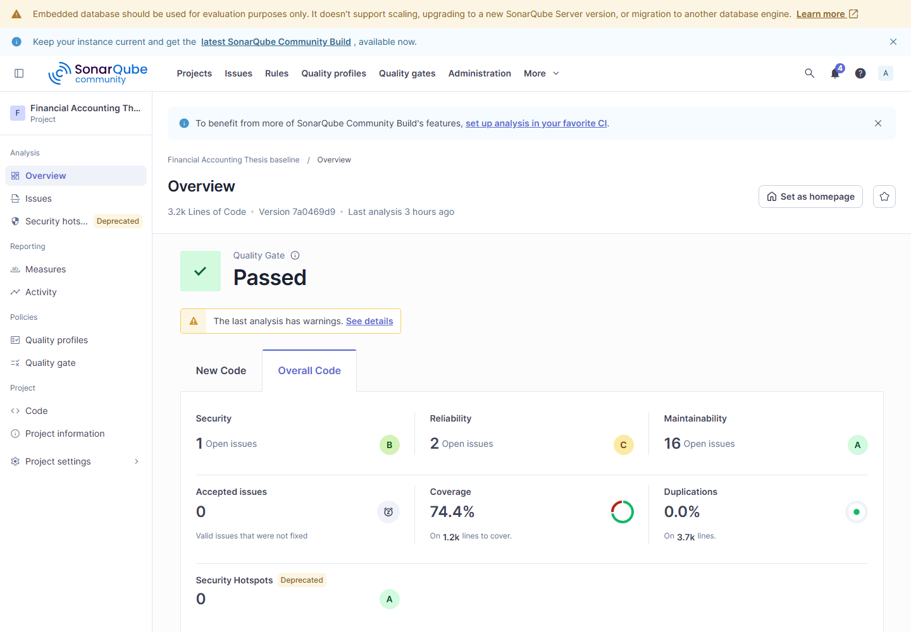

Classification: `fresh-reproduction`; role: `baseline`; branch: `origin/baseline-v0.1`; commit: `7a0469d9`; run: `20260922-183352`; tool version: `26.7.0.124771`; source: [`docs/appendix/verification-runs/research/sonar/baseline/summary.json`](../../docs/appendix/verification-runs/research/sonar/baseline/summary.json).

#### baseline-issues

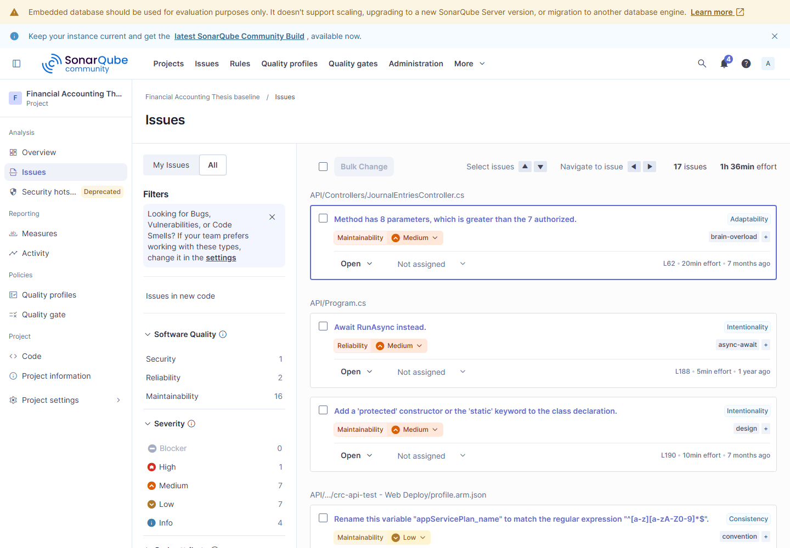

Classification: `fresh-reproduction`; role: `baseline`; branch: `origin/baseline-v0.1`; commit: `7a0469d9`; run: `20260922-183352`; tool version: `26.7.0.124771`; source: [`docs/appendix/verification-runs/research/sonar/baseline/summary.json`](../../docs/appendix/verification-runs/research/sonar/baseline/summary.json).

#### remediation-overview

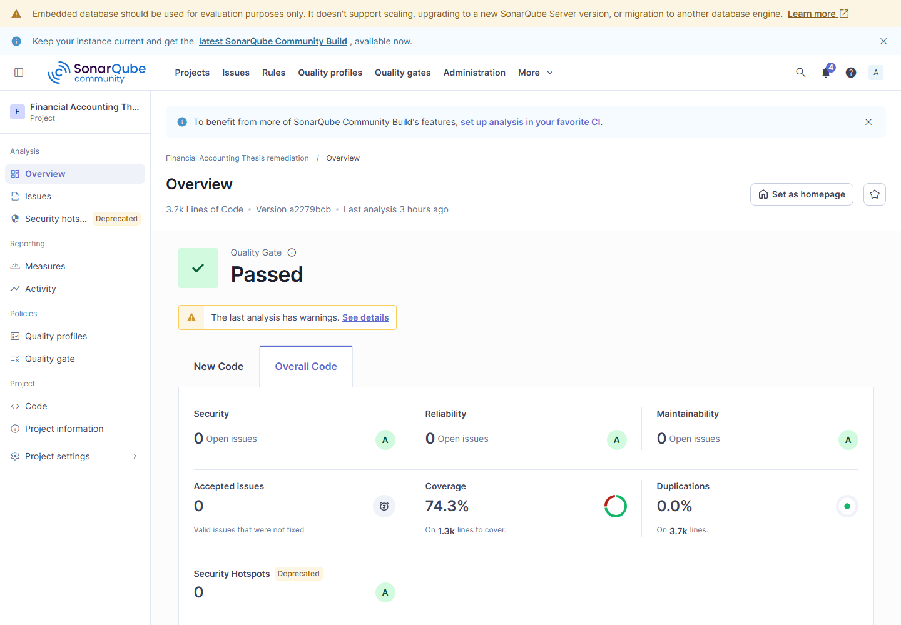

Classification: `fresh-reproduction`; role: `remediation`; branch: `origin/baseline-sonarqube-v1`; commit: `a2279bcb`; run: `20260922-183352`; tool version: `26.7.0.124771`; source: [`docs/appendix/verification-runs/research/sonar/remediation/summary.json`](../../docs/appendix/verification-runs/research/sonar/remediation/summary.json).

#### remediation-issues

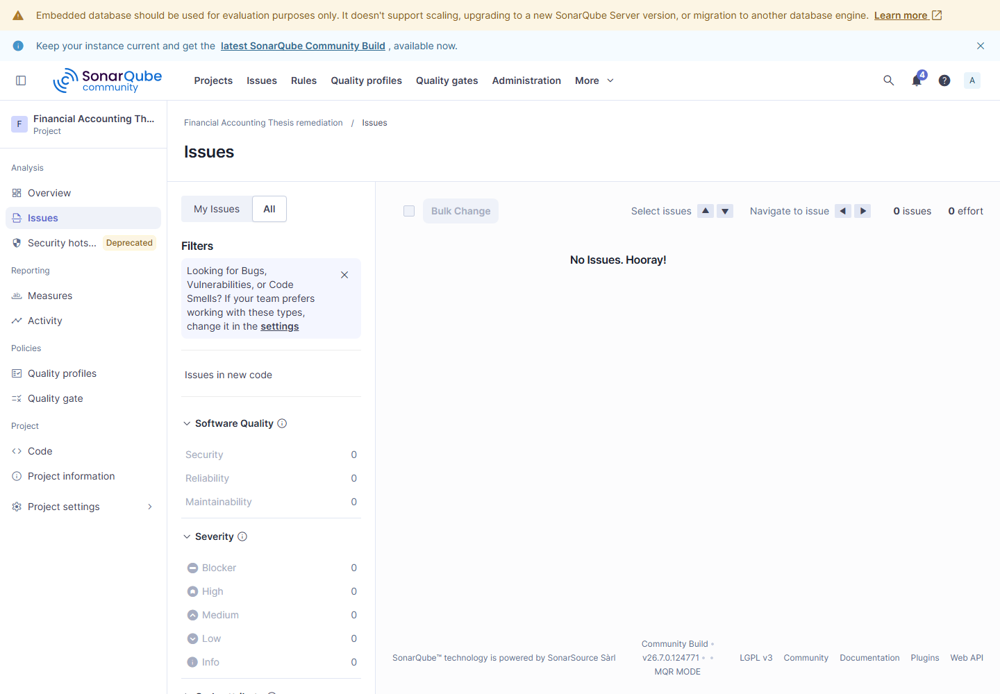

Classification: `fresh-reproduction`; role: `remediation`; branch: `origin/baseline-sonarqube-v1`; commit: `a2279bcb`; run: `20260922-183352`; tool version: `26.7.0.124771`; source: [`docs/appendix/verification-runs/research/sonar/remediation/summary.json`](../../docs/appendix/verification-runs/research/sonar/remediation/summary.json).

### OWASP ZAP Dashboards

#### baseline-before-summary

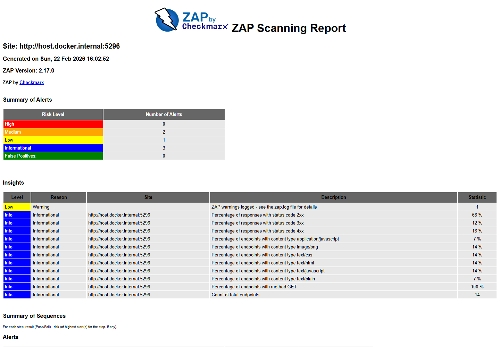

Classification: `rendered-historical`; role: `baseline`; branch: `origin/baseline-v0.1`; commit: `7a0469d9`; run: `20260222-230133`; tool version: `2.17.0`; source: [`Document/security/zap-baseline-20260222-230133.json`](../../Document/security/zap-baseline-20260222-230133.json).

#### baseline-after-summary

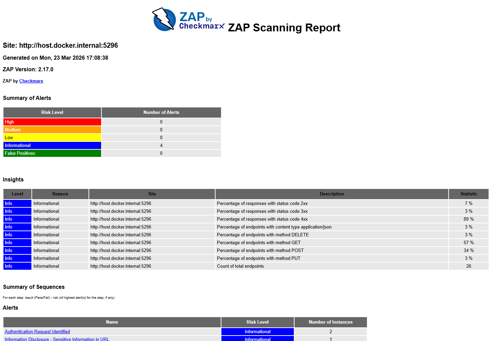

Classification: `rendered-historical`; role: `remediation`; branch: `origin/baseline-zap-v1`; commit: `5f3bd3cc`; run: `20260324-000724`; tool version: `2.17.0`; source: [`Document/security/zap-baseline-20260324-000724.json`](../../Document/security/zap-baseline-20260324-000724.json).

#### api-before-summary

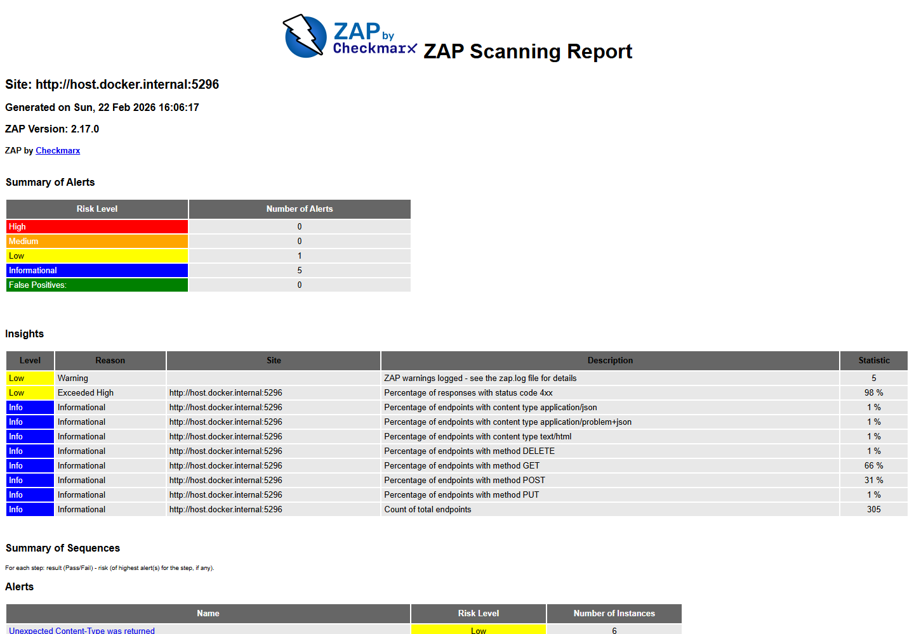

Classification: `rendered-historical`; role: `baseline`; branch: `origin/baseline-v0.1`; commit: `7a0469d9`; run: `20260222-230133`; tool version: `2.17.0`; source: [`Document/security/zap-api-20260222-230133.json`](../../Document/security/zap-api-20260222-230133.json).

#### api-after-summary

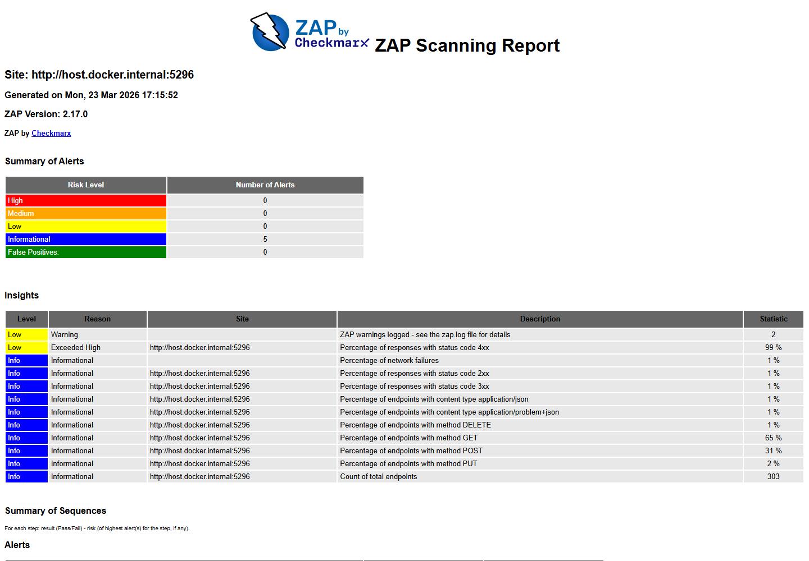

Classification: `rendered-historical`; role: `remediation`; branch: `origin/baseline-zap-v1`; commit: `5f3bd3cc`; run: `20260324-000856`; tool version: `2.17.0`; source: [`Document/security/zap-api-20260324-000856.json`](../../Document/security/zap-api-20260324-000856.json).

### Apache JMeter Dashboards

#### baseline-p50-dashboard

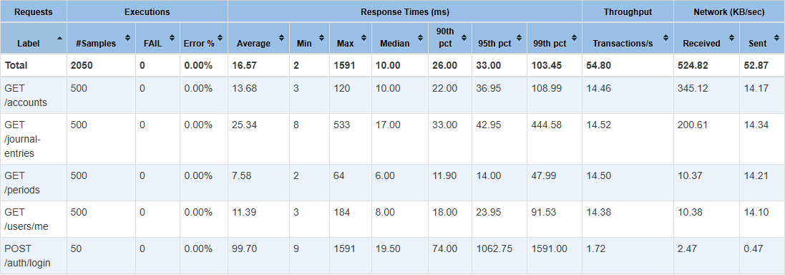

Classification: `fresh-reproduction`; role: `baseline`; branch: `origin/baseline-v0.1`; commit: `7a0469d9`; run: `baseline-20260922-192730`; tool version: `5.5`; source: [`docs/appendix/verification-runs/research/jmeter/baseline/report-baseline-20260922-192730-p50/statistics.json`](../../docs/appendix/verification-runs/research/jmeter/baseline/report-baseline-20260922-192730-p50/statistics.json).

#### baseline-p100-dashboard

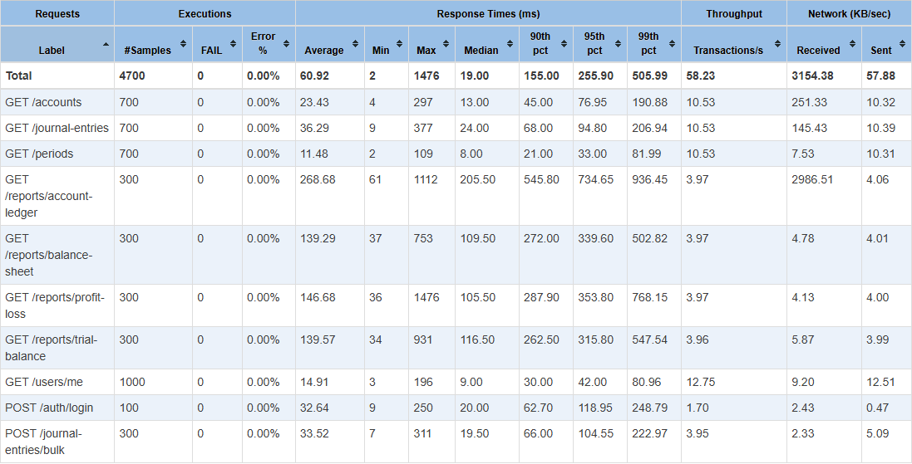

Classification: `fresh-reproduction`; role: `baseline`; branch: `origin/baseline-v0.1`; commit: `7a0469d9`; run: `baseline-20260922-192730`; tool version: `5.5`; source: [`docs/appendix/verification-runs/research/jmeter/baseline/report-baseline-20260922-192730-p100/statistics.json`](../../docs/appendix/verification-runs/research/jmeter/baseline/report-baseline-20260922-192730-p100/statistics.json).

#### baseline-p500-dashboard

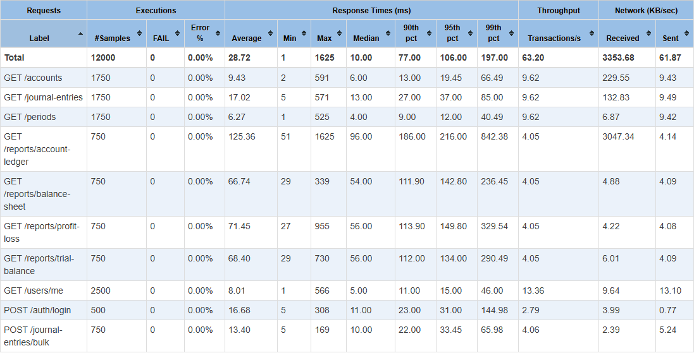

Classification: `fresh-reproduction`; role: `baseline`; branch: `origin/baseline-v0.1`; commit: `7a0469d9`; run: `baseline-20260922-192730`; tool version: `5.5`; source: [`docs/appendix/verification-runs/research/jmeter/baseline/report-baseline-20260922-192730-p500/statistics.json`](../../docs/appendix/verification-runs/research/jmeter/baseline/report-baseline-20260922-192730-p500/statistics.json).

#### baseline-soak-dashboard


Classification: `fresh-reproduction`; role: `baseline`; branch: `origin/baseline-v0.1`; commit: `7a0469d9`; run: `baseline-20260922-192730`; tool version: `5.5`; source: [`docs/appendix/verification-runs/research/jmeter/baseline/report-baseline-20260922-192730-soak/statistics.json`](../../docs/appendix/verification-runs/research/jmeter/baseline/report-baseline-20260922-192730-soak/statistics.json).

#### baseline-spike-dashboard

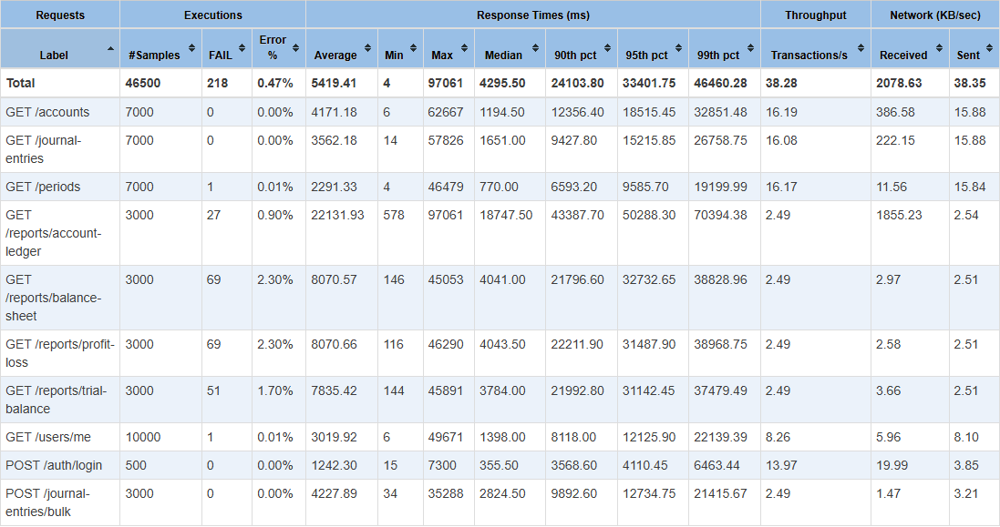

Classification: `fresh-reproduction`; role: `baseline`; branch: `origin/baseline-v0.1`; commit: `7a0469d9`; run: `baseline-20260922-192730`; tool version: `5.5`; source: [`docs/appendix/verification-runs/research/jmeter/baseline/report-baseline-20260922-192730-spike/statistics.json`](../../docs/appendix/verification-runs/research/jmeter/baseline/report-baseline-20260922-192730-spike/statistics.json).

#### remediation-p50-dashboard

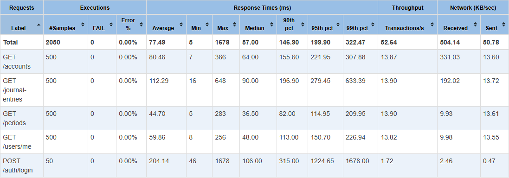

Classification: `fresh-reproduction`; role: `remediation`; branch: `origin/baseline-jmeter-v1`; commit: `78b08b62`; run: `remediation-20260922-200712`; tool version: `5.5`; source: [`docs/appendix/verification-runs/research/jmeter/remediation/report-remediation-20260922-200712-p50/statistics.json`](../../docs/appendix/verification-runs/research/jmeter/remediation/report-remediation-20260922-200712-p50/statistics.json).

#### remediation-p100-dashboard

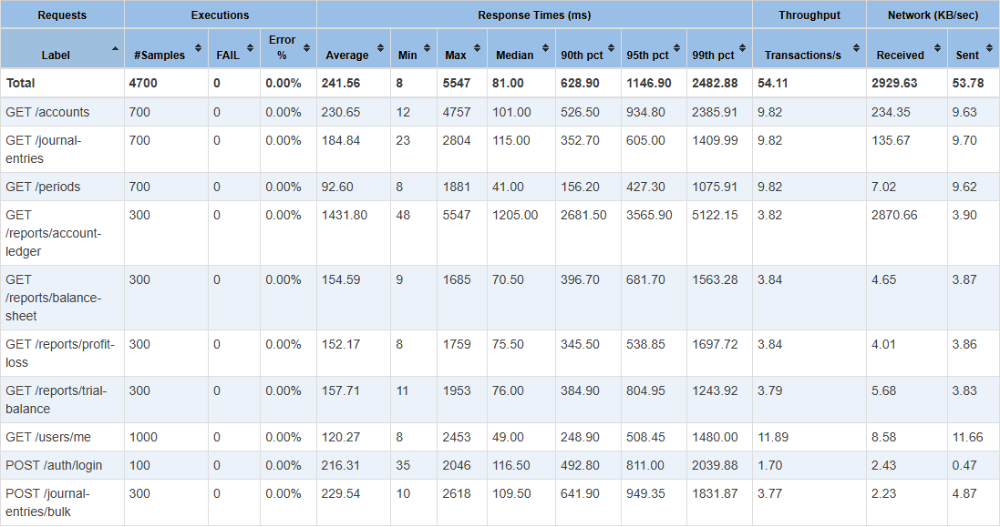

Classification: `fresh-reproduction`; role: `remediation`; branch: `origin/baseline-jmeter-v1`; commit: `78b08b62`; run: `remediation-20260922-200712`; tool version: `5.5`; source: [`docs/appendix/verification-runs/research/jmeter/remediation/report-remediation-20260922-200712-p100/statistics.json`](../../docs/appendix/verification-runs/research/jmeter/remediation/report-remediation-20260922-200712-p100/statistics.json).

#### remediation-p500-dashboard


Classification: `fresh-reproduction`; role: `remediation`; branch: `origin/baseline-jmeter-v1`; commit: `78b08b62`; run: `remediation-20260922-200712`; tool version: `5.5`; source: [`docs/appendix/verification-runs/research/jmeter/remediation/report-remediation-20260922-200712-p500/statistics.json`](../../docs/appendix/verification-runs/research/jmeter/remediation/report-remediation-20260922-200712-p500/statistics.json).

#### remediation-soak-dashboard

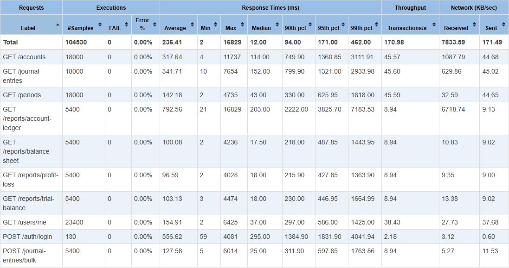

Classification: `fresh-reproduction`; role: `remediation`; branch: `origin/baseline-jmeter-v1`; commit: `78b08b62`; run: `remediation-20260922-200712`; tool version: `5.5`; source: [`docs/appendix/verification-runs/research/jmeter/remediation/report-remediation-20260922-200712-soak/statistics.json`](../../docs/appendix/verification-runs/research/jmeter/remediation/report-remediation-20260922-200712-soak/statistics.json).

#### remediation-spike-dashboard

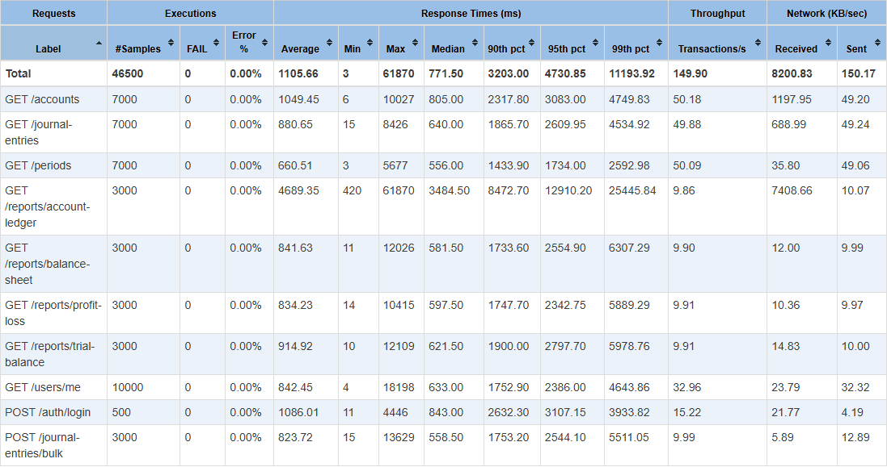

Classification: `fresh-reproduction`; role: `remediation`; branch: `origin/baseline-jmeter-v1`; commit: `78b08b62`; run: `remediation-20260922-200712`; tool version: `5.5`; source: [`docs/appendix/verification-runs/research/jmeter/remediation/report-remediation-20260922-200712-spike/statistics.json`](../../docs/appendix/verification-runs/research/jmeter/remediation/report-remediation-20260922-200712-spike/statistics.json).

## Appendix G - Working Application Demonstration

- API live and ready endpoints: True / True
- Frontend smoke result: True
- Browser login/report/role workflow: PASS
- Demonstrated areas: login, role-aware navigation, accounts, journal lines, periods, reports, audit logs, user administration, and research evidence.
- Demo credentials are local-only and intentionally omitted from this appendix source.

## Appendix H - Known Limitations

- The current paper evaluates one ASP.NET Core financial-accounting API and attributes remediation evidence to GPT-5.4.
- GPT-5.5 and new-API v2 work is supplemental and is not current-paper evidence.
- Fresh SonarQube, ZAP, and JMeter values can differ because of tool versions, host load, database state, and runtime conditions.
- The current local database exceeds the paper minimum dataset, so performance reruns must record their actual counts or use an isolated clean local database.
- Mixed-workload soak/spike drift remains a documented limitation.
- A dashboard screenshot is accepted only when its manifest links it to the same run and machine-readable source artifact.
